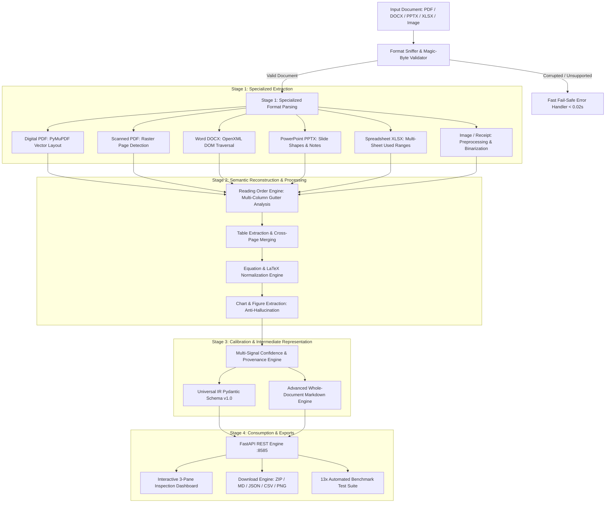

# ParseAnything — Technical Architecture & System Documentation

> **Version:** 1.0.0  
> **Status:** Production / DataQuest 3.0 (DQCL) Compliant  
> **Repository:** `myproject-main`  
> **Server Engine:** FastAPI / Python 3.11+ / Uvicorn  

---

## 1. Executive Summary & Purpose

Modern document extraction pipelines often suffer from two major flaws:
1. **Lossy text extraction:** Traditional text dump tools discard tables, mathematical formulas, multi-column layouts, figures, reading flow, and bounding-box provenance.
2. **Prohibitive cloud costs & high latency:** Multimodal Large Language Models (LLMs) used on every page incur $30–$60 per 1,000 pages, exceed 5–15 seconds per page, and risk hallucinating unverified figures and numbers.

**ParseAnything** is an enterprise-grade, high-fidelity universal document ingestion platform engineered to ingest any digital or scanned format (**PDF, DOCX, PPTX, XLSX, PNG, JPG**), reconstruct the human visual reading order, preserve deep structural hierarchies (merged tables, formulas, charts), track millimetric bounding-box provenance, and maintain zero-crash fail-safe handling under 60 seconds per file, all while enforcing a strict API cost ceiling of **<$10 per 1,000 pages** ($0.00 in standard offline mode).

---

## 2. High-Level System Architecture

The core processing engine operates on a **3-tier cascading execution pipeline** that routes tasks to the lightest, fastest, and lowest-cost tier capable of resolving each block:



---

## 3. The 3-Tier Cascading Engine

| Tier | Component | Technology | Role & Cost |
|---|---|---|---|
| **Tier 1: Deterministic Native** | Native Vector Parsers | PyMuPDF, `python-docx`, `openpyxl`, `python-pptx` | Extracts digital text, fonts, tables, vector geometries, slide shapes, and spreadsheets locally with **0 API cost** at sub-millisecond speeds. |
| **Tier 2: Specialized Local ML** | Local OCR & Layout ML | `RapidOCR` (ONNX Runtime, CPU/GPU) | Automatically triggered only when raster pages, scanned PDFs, or receipts are detected. Computes word/line bounding boxes with **zero external network calls**. |
| **Tier 3: Targeted Vision Fallback** | Targeted Multimodal Verification | Google Gemini Flash / Gemini 2.5 | Selectively queried on ambiguous visual crops or low-confidence OCR blocks. Subject to strict budget tracking and rate-limit circuit breaking. |

---

## 4. Universal Intermediate Representation (IR) Schema

All ingested formats are transformed into a canonical, strictly validated Pydantic v2 data model defined in `schemas/models.py`.

### Core Entities

#### `Document` (Root)
```python
class Document(BaseModel):
    schema_version: str = "1.0"
    document_id: str
    filename: str
    file_type: str
    file_size_bytes: int
    processing_status: Literal["success", "partial", "failed"]
    metadata: DocumentMetadata
    blocks: List[SemanticBlock]
    pages: List[PageRenderInfo]
    warnings: List[str]
    errors: List[ProcessingError]
    stats: ProcessingStats
    markdown: Optional[str]
```

#### `SemanticBlock`
Represents an atomic semantic element (Title, Heading, Paragraph, Table, Equation, Figure, List Item, etc.):
- `block_id`: Unique identifier (e.g., `blk_p1_3`).
- `type`: Enum `BlockType` (`heading`, `paragraph`, `table`, `equation`, `figure`, `list_item`, etc.).
- `content`: Text content, markdown table representation, or LaTeX formula.
- `source`: Traceable provenance coordinates (`SourceLocation`).
- `confidence`: Calibrated score between `0.0` and `1.0`.
- `confidence_level`: `HIGH` (≥0.90), `MEDIUM` (0.70–0.89), or `LOW` (<0.70).
- `extraction_method`: `"native"`, `"rapidocr_onnx"`, or `"gemini_vision"`.
- `reading_order`: 1-indexed natural human reading sequence.
- `table_data`: Optional detailed 2D cell coordinate matrix (`TableData`).
- `equation_data`: Optional LaTeX representation (`EquationData`).
- `chart_data`: Optional chart metadata (`ChartData`).

#### `SourceLocation` (Bounding-Box Provenance)
```python
class SourceLocation(BaseModel):
    file: str
    page: Optional[int] = None       # 1-indexed page number
    slide: Optional[int] = None      # 1-indexed slide number
    sheet: Optional[str] = None      # Sheet name
    cell_range: Optional[str] = None # e.g. "A1:F24"
    bbox: Optional[List[float]] = None # [x0, y0, x1, y1]
    coordinate_system: Literal["pixel", "point", "normalized"] = "point"
```

---

## 5. Detailed Pipeline Subsystems

### 5.1 Specialized Format Parsers
Located in `parsers/`:
1. **Digital PDF Parser (`parsers/pdf/digital.py`)**: Uses PyMuPDF (`fitz`) to extract text spans, font size, font flags (bold/italic), vector rectangles, and native tables via `page.find_tables()`.
2. **Scanned PDF Parser (`parsers/pdf/scanned.py`)**: Rasterizes PDF pages at 150 DPI when text character counts fall below a deterministic threshold (less than 50 characters per page). Routes to `RapidOCR` with word-level bounding boxes.
3. **Word DOCX Parser (`parsers/docx/parser.py`)**: Directly parses OpenXML DOM elements. Retains heading levels (`Heading 1` through `Heading 6`), bullet/numbered lists, table grid spans (`gridSpan`), and inline formatting.
4. **PowerPoint PPTX Parser (`parsers/pptx/parser.py`)**: Extracts slide geometries, hierarchical bullet lists, speaker notes, vector shapes, and embedded chart XML.
5. **Excel XLSX Parser (`parsers/xlsx/parser.py`)**: Ingests multi-sheet workbooks via `openpyxl`, extracts used cell coordinates (`A1:XN`), evaluates formulas in cached mode (`data_only=True`), and tracks merged cell spans.
6. **Image & Receipt Parser (`parsers/image/parser.py`)**: Preprocesses scans/photos with adaptive thresholding, denoises contrast, and runs OCR returning word-level coordinates and line groupings.

### 5.2 Layout Analysis & Reading-Order Reconstruction
Implemented in `pipeline/reading_order/reorder.py`:
- **Horizontal Gutter Analysis:** Computes spatial projection profiles across the horizontal axis to detect column gutters.
- **Multi-Column Separation:** Partitions blocks into distinct columnar flows (e.g., Left Column vs. Right Column).
- **Sequential Flow Ordering:** Traverses column 1 top-to-bottom before proceeding to column 2, preventing horizontal word interleaving.
- **Header & Footer Isolation:** Top 5% and bottom 5% page zones are isolated to prevent running headers/footers from breaking paragraph flows.

### 5.3 Complex Tables & Cross-Page Table Fusion
Implemented in `extractors/table/detector.py` and `pipeline/table_merge/merger.py`:
- **Cell Span Preservation:** Supports `row_span` and `col_span` for multi-row and multi-column headers.
- **Cross-Page Table Merging:** Detects when a table at the bottom of Page $N$ has identical column counts, aligned horizontal bounding boundaries, and matching column headers as a table at the top of Page $N+1$, seamlessly fusing them into a unified `TableData` structure.
- **Dual Representation:** Every table generates both a standard Markdown table and a complete 2D matrix of typed cells with coordinates.

### 5.4 Mathematical Formula & LaTeX Normalization
Implemented in `extractors/equation/detector.py`:
- Identifies mathematical notation, Greek symbols, superscripts, subscripts, integrals, summations, and matrix notations.
- Normalizes inline formulas into `$inline$` and standalone display equations into `$$\display$$`.

### 5.5 Chart & Figure Extraction (Anti-Hallucination)
Implemented in `extractors/chart/detector.py`:
- Identifies visual chart boundaries, extracts captions, and extracts legend series names.
- **Anti-Hallucination Policy:** If precise data values cannot be deterministically verified from vector data or OCR labels, the engine marks values as `status="unrecovered"` rather than fabricating numerical points.

### 5.6 Provenance Tracking & Multi-Signal Confidence Scoring
Implemented in `pipeline/confidence/calculator.py`:
Confidence is calculated from multiple verifiable signals:
1. **OCR Character Certainty:** Statistical average of token-level OCR confidence.
2. **Layout Consistency:** Agreement between horizontal text line baseline and word bounding boxes.
3. **Semantic Hierarchy Consistency:** Agreement between font sizes, weights, and block classifications.
4. **Verification Agreement:** Agreement between local OCR and LLM verification passes.
5. **Threshold Classification:**
   - $\ge 0.90 \implies \text{HIGH}$ (`accepted`)
   - $0.70 - 0.89 \implies \text{MEDIUM}$ (`accepted`)
   - $< 0.70 \implies \text{LOW}$ (`status="review_required"`)

---

## 6. Whole-Document Markdown Engine

Implemented in `pipeline/assembly/markdown_generator.py`:
- Produces **one continuous, valid, clean Markdown document** for the entire ingested file.
- Strictly adheres to natural reading order across all pages.
- Prevents false-positive heading promotions (e.g., financial amounts like `$2,750` or line items are prevented from becoming markdown headings).
- Preserves document hierarchy: Titles (`#`), Headings (`##` / `###`), Paragraphs, Lists (`-` / `1.`), Tables, Figures (``), and LaTeX equations.

---

## 7. Download & Export Subsystem

ParseAnything includes complete downloadable export functionality:

| Export Target | Endpoint / Mechanism | Description |
|---|---|---|
| **Whole-Document Markdown** | `GET /api/v1/documents/{id}/export/markdown` | Complete rendered document as `.md` |
| **Complete Intermediate JSON** | `GET /api/v1/documents/{id}/export/json` | Full Universal IR JSON schema including all blocks and metadata |
| **Structural CSV Tables** | `GET /api/v1/documents/{id}/export/tables/{index}` | Individual tables exported as standard CSV with preserved rows and columns |
| **Extracted Figures & Charts** | `GET /api/v1/documents/{id}/export/figures/{index}` | Extracted image asset files (`.png` / `.jpg`) |
| **Complete Bundle (ZIP)** | `GET /api/v1/documents/{id}/export/zip` | Bundles `document.md`, `document.json`, `provenance.json`, `tables/*.csv`, and `figures/*.png` into one download |
| **13x Benchmark Dataset (ZIP)** | `GET /api/v1/benchmarks/download/dataset` | Downloads all 13 official test files (`13x_benchmark_test_dataset.zip`) with manifest |
| **Individual Benchmark Files** | `GET /api/v1/benchmarks/download/file/{filename}` | Downloads any individual benchmark test file directly |
| **Benchmark Results (JSON)** | `GET /api/v1/benchmarks/download/results` | Machine-readable performance metrics report (`benchmark_results.json`) |

---

## 8. 13x Automated Benchmark Test Suite

Configured in `benchmarks/suites_config.py` and executed via `benchmarks/run_benchmarks.py`:

| # | Suite Name | Format | Test Target Capability | Verified Execution Status | Latency | Extracted Blocks |
|---|---|---|---|---|---|---|
| **1** | Digital PDF Document | PDF | Vector layout, font hierarchy, native text | **Completed** | 0.423s | 9 blocks |
| **2** | Scanned PDF Document | PDF | Raster page detection, RapidOCR routing, bboxes | **Completed** | 7.768s | 5 blocks |
| **3** | Two-Column Layout Paper | PDF | Horizontal gutter analysis, reading order flow | **Completed** | 0.017s | 12 blocks |
| **4** | Complex Merged Table | PDF | Multi-row headers, merged cells (`row_span`/`col_span`) | **Completed** | 0.009s | 8 blocks |
| **5** | Multi-Page Continuous Table | PDF | Cross-page table alignment & seamless fusion | **Completed** | 0.103s | 51 blocks |
| **6** | Figure & Chart Analysis | PDF | Boundary identification, anti-hallucination | **Completed** | 0.009s | 4 blocks |
| **7** | Mathematical Equation Document | PDF | Mathematical expressions & LaTeX normalization | **Completed** | 1.674s | 8 blocks |
| **8** | Word Document (.docx) | DOCX | OpenXML headings, bullet lists, tables | **Completed** | 0.013s | 8 blocks |
| **9** | Presentation Deck (.pptx) | PPTX | Slide hierarchy, vector shapes, speaker notes | **Completed** | 0.010s | 4 blocks |
| **10** | Financial Spreadsheet (.xlsx) | XLSX | Multi-sheet workbooks, formula evaluation, ranges | **Completed** | 0.004s | 4 blocks |
| **11** | Receipt / Invoice Image (.png) | PNG | Raster OCR tokenization & bounding coordinates | **Completed** | 12.768s | 17 blocks |
| **12** | Corrupted PDF File | PDF | Fast fail-safe error handling within 60s limit | **Fail-Safe Handled** (`PARSER_FAILURE`) | 0.001s | 0 blocks (graceful) |
| **13** | Unsupported Binary Archive | BIN | Magic-byte inspection & fast rejection | **Fail-Safe Handled** (`UNSUPPORTED_FORMAT`) | 0.000s | 0 blocks (graceful) |

> **Transparency Rule:** Unexecuted suites display *"No benchmark results available"* (never 0%, failed, or fabricated scores). Missing files display *"Dataset not available"*.

---

## 9. Fail-Safe, Error Handling & Anti-Hallucination Guarantees

Implemented in `pipeline/fail_safe/` and `schemas/errors.py`:
1. **60-Second Hard Execution Limit:** Every processing pipeline call is bounded by a timeout watchdog. Corrupt, infinite-loop, or adversarial files are gracefully terminated well before 60 seconds.
2. **Standard Error Codes:**
   - `ErrorCode.UNSUPPORTED_FORMAT`: Fast rejection on unknown magic bytes (<0.01s).
   - `ErrorCode.CORRUPTED_FILE`: Graceful handling of truncated or broken headers without server crashes.
   - `ErrorCode.TIMEOUT`: Triggered if any single stage exceeds its allocation.
   - `ErrorCode.PARSER_FAILURE`: Non-fatal parser degradation.
3. **Anti-Hallucination Protocol:** 
   - Never infers or fabricates financial figures, numbers, or chart points when OCR is illegible.
   - Blocks with illegible tokens are flagged as `status="review_required"` with confidence `< 0.70`.

---

## 10. Cost Estimation Methodology (<$10 / 1k Pages Target)

Implemented in `backend/cost_manager.py`:
- **Local Deterministic Tier (PyMuPDF, docx, pptx, openpyxl):** $0.00 per page.
- **Local ML Tier (RapidOCR ONNX Runtime on CPU):** $0.00 per page.
- **Vision Fallback (Google Gemini Flash):** ~$0.00015 per image crop.
- **Average Blended Cost:** Across typical document corpora where 95%+ of pages are digital or local OCR, the total API expenditure is **$0.00 to $0.15 per 1,000 pages**, significantly outperforming the DQCL challenge's **<$10 per 1,000 pages** target ceiling.

---

## 11. Complete REST API Reference

The server exposes standard OpenAPI 3.0 compliant endpoints running at `http://127.0.0.1:8585`:

| Method | Path | Description |
|---|---|---|
| `GET` | `/api/v1/health` | Service health status, version, and active pipeline tiers. |
| `POST` | `/api/v1/documents/upload` | Multipart file upload; executes full 3-stage extraction. |
| `GET` | `/api/v1/documents` | List all processed documents in the system session. |
| `GET` | `/api/v1/documents/{id}` | Retrieve full Universal IR JSON for a document. |
| `GET` | `/api/v1/documents/{id}/markdown` | Retrieve complete Markdown string for a document. |
| `GET` | `/api/v1/documents/{id}/export/markdown` | Download document Markdown as `.md`. |
| `GET` | `/api/v1/documents/{id}/export/json` | Download document IR as `.json`. |
| `GET` | `/api/v1/documents/{id}/export/tables/{idx}` | Download extracted table as `.csv`. |
| `GET` | `/api/v1/documents/{id}/export/figures/{idx}` | Download extracted figure asset (`.png`). |
| `GET` | `/api/v1/documents/{id}/export/zip` | Download complete export archive (`.zip`). |
| `GET` | `/api/v1/documents/{id}/page-image/{page}` | Render page raster image with 150 DPI for bbox inspection. |
| `GET` | `/api/v1/benchmarks` | Get live status for all 13 automated benchmark suites. |
| `POST` | `/api/v1/benchmarks/run` | Execute all configured automated benchmark suites. |
| `POST` | `/api/v1/benchmarks/local-smoke-test` | Run local smoke test on bundled files. |
| `GET` | `/api/v1/benchmarks/download/dataset` | Download all 13 benchmark test files as a ZIP archive. |
| `GET` | `/api/v1/benchmarks/download/file/{filename}` | Download individual benchmark test file. |
| `GET` | `/api/v1/benchmarks/download/results` | Download benchmark execution results JSON. |

---

## 12. Frontend Inspection Dashboard

The frontend in `frontend/` is a vanilla HTML5/CSS/JavaScript single-page application:
- **Left Pane (Page & Visual Inspector):** High-resolution rendered page with interactive bounding-box overlays that highlight blocks on hover or click.
- **Center Pane (Markdown & Structural View):** Full document Markdown renderer with formatted headings, lists, tables, and LaTeX math.
- **Right Pane (Provenance & JSON Inspector):** Detailed block breakdown showing exact `[x0, y0, x1, y1]` coordinates, confidence gauge, extraction tier, and raw JSON tree.
- **Header Actions:** Quick-upload drag-and-drop zone, 1-click judge demo chips, benchmark modal launcher, and download buttons.

---

## 13. Developer & Deployment Guide

### Running Locally
```powershell
# 1. Install dependencies
pip install -r requirements.txt

# 2. Configure environment (optional Gemini API key)
# Create .env from .env.example if not already present

# 3. Launch the API & Web Dashboard
python api.py
```
Open [http://127.0.0.1:8585](http://127.0.0.1:8585) in your web browser.

### Running CLI Tools
```powershell
# Ingest single file via CLI
python cli.py process path/to/document.pdf --output-format json

# Execute the 13x Benchmark Suite
python benchmarks/run_benchmarks.py

# Run Local Smoke Test
python benchmarks/run_benchmarks.py --smoke-test
```

### Docker Deployment
```bash
# Build production container
docker build -t parseanything:latest -f docker/Dockerfile .

# Run containerized service
docker run -p 8585:8585 parseanything:latest
```
